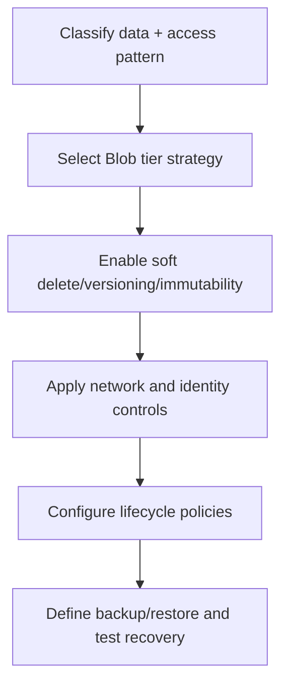
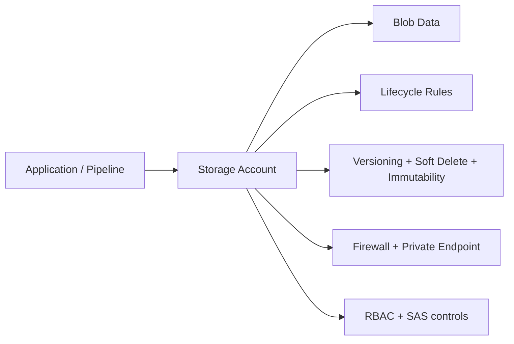
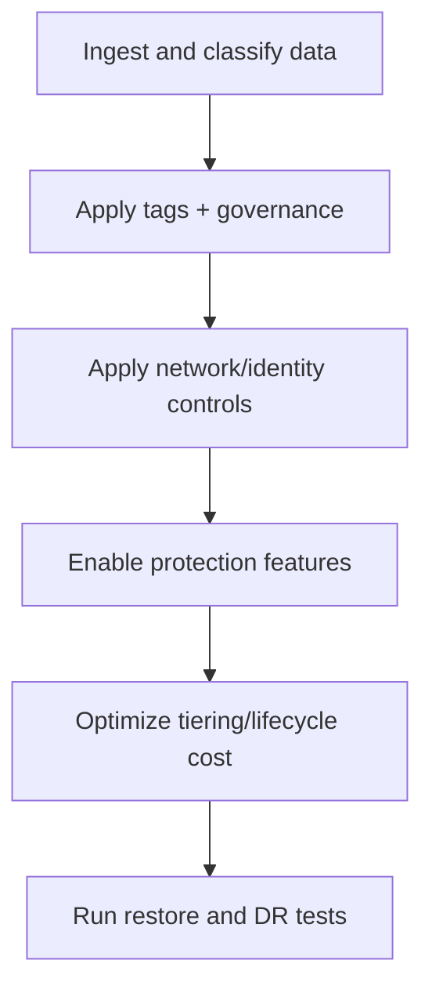
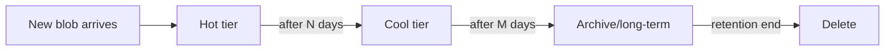
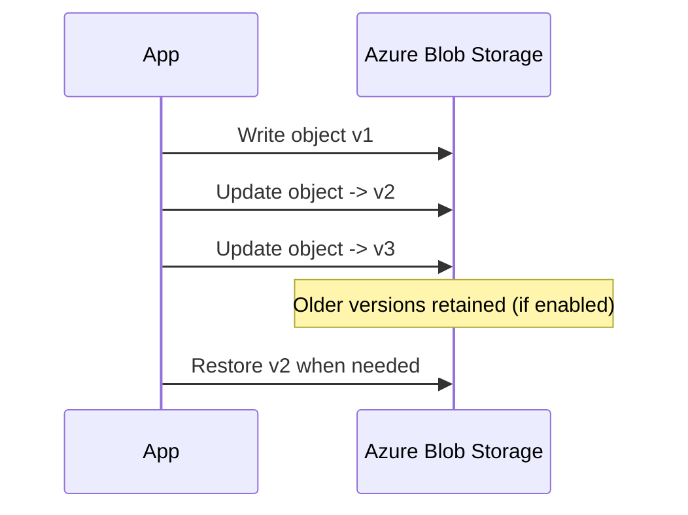
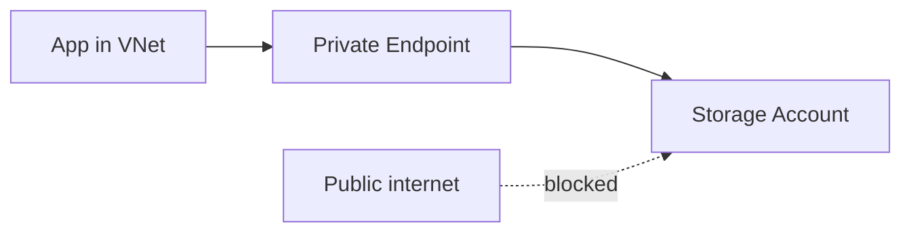
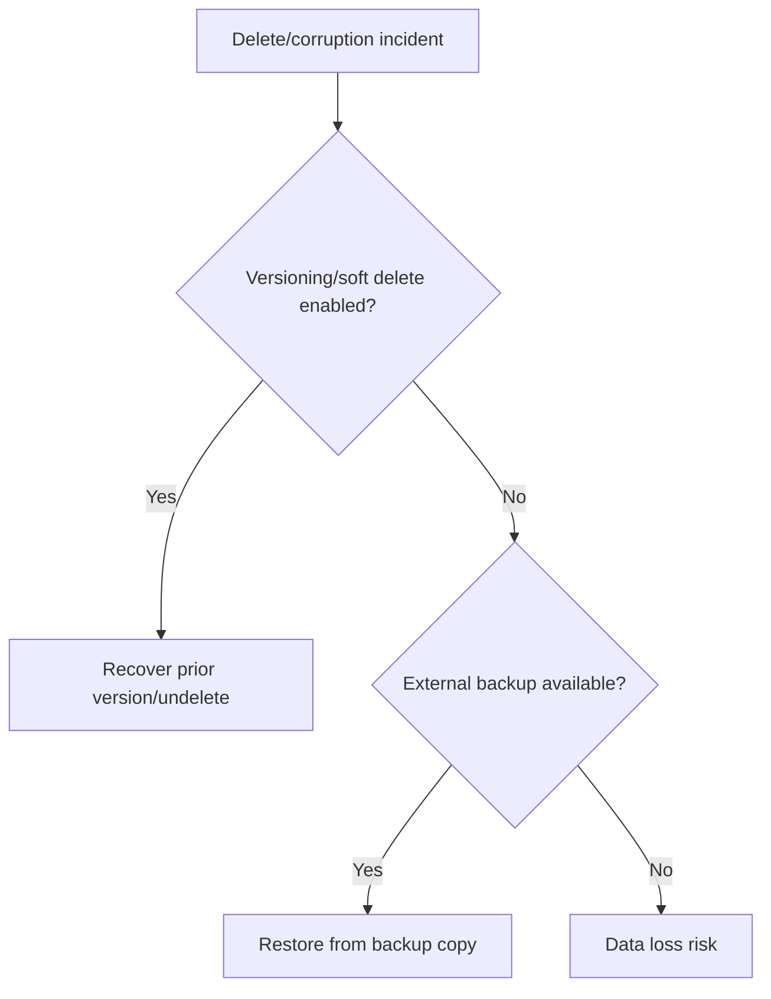

# Azure Storage Deep Dive

## What is it?
Azure Storage is Microsoft Azure’s durable cloud storage platform for object, file, queue, and table workloads. This deep dive focuses on:
- Blob tiers and lifecycle management
- Immutability, soft delete, and versioning
- Security controls (private endpoints, firewall, SAS, RBAC)
- Backup and restore patterns

## What is it used for?
- Storing application data, logs, backups, media, and archives
- Serving static content and data lakes
- Retention and compliance workloads
- Disaster recovery and recovery-point patterns

## Why is it important?
Storage is the persistence layer for most systems. Wrong choices in tiering, security, or recovery design can cause high cost, data loss risk, or compliance issues.

## Workflow


## End-to-end architecture view


## Operational workflow (day-2)


---

## 1) Blob tiers and lifecycle

### Access tiers (Blob)

| Tier | Best for | Cost model |
|---|---|---|
| Hot | Frequently accessed data | Higher storage, lower access cost |
| Cool | Infrequently accessed (30+ days) | Lower storage, higher access cost |
| Cold/Archive strategy* | Rarely accessed historical data | Lowest storage, retrieval delay/cost |

> Choose tiers by **access frequency + retention duration**, not by file type alone.

### Lifecycle management
Use lifecycle rules to automatically transition/delete data based on age, tags, or last modified time.



### Design tips
- Keep critical operational data in Hot/Cool with predictable retrieval.
- Move compliance/historical data using lifecycle transitions.
- Tag data classes to drive policy-based movement.

---

## 2) Data protection controls

## Immutability
Immutability prevents changes/deletes for a retention period.

Modes:
- Time-based retention policy
- Legal hold

Useful for compliance and ransomware resilience.

## Soft delete
Soft delete keeps deleted blobs/containers recoverable for a configured retention window.

## Versioning
Versioning stores multiple historical versions of objects, allowing rollback to a known-good version.



### Recommended baseline
- Enable blob versioning for mutable critical data.
- Enable soft delete for blob + container.
- Use immutability where compliance/regulatory needs exist.

---

## 3) Storage security deep dive

## Identity controls
- Prefer Microsoft Entra + RBAC for data plane authorization.
- Use managed identities for workloads.
- Avoid shared keys when possible.

## SAS (Shared Access Signature)
SAS gives time-scoped and permission-scoped delegated access.

Best practices:
- Short expiry
- Minimum permissions
- Prefer user delegation SAS where supported
- Rotate and monitor usage

## Network controls
- Storage firewall rules (selected networks only)
- Private endpoint for private access from VNet
- Disable public network access where feasible



## Encryption and key management
- Encryption at rest is default
- Consider customer-managed keys (CMK) where required

---

## 4) Backup/restore patterns

### Pattern A: Operational recovery
- Versioning + soft delete
- Fast restore of recently changed/deleted data

### Pattern B: Compliance retention
- Immutability policy + legal hold
- Strict no-modify/no-delete window

### Pattern C: DR and long-term retention
- Replication strategy + periodic restore testing
- Clearly define $RPO$ and $RTO$ targets



---

## 5) Azure Portal checks

1. Storage account -> **Data protection**
   - blob soft delete
   - container soft delete
   - versioning
   - point-in-time restore (if used)
2. Storage account -> **Networking**
   - firewall mode
   - private endpoint connections
3. Storage account -> **Lifecycle management**
   - active rules and filters
4. Storage account -> **Access control (IAM)**
   - RBAC roles and assignments

---

## 6) Azure CLI checks (placeholders only)

```bash
# Storage account baseline settings
az storage account show -g <rg> -n <storage-account-name> -o jsonc

# List lifecycle policy
az storage account management-policy show \
  --account-name <storage-account-name> \
  --resource-group <rg> -o jsonc

# List private endpoints for storage account
az network private-endpoint-connection list \
  --id /subscriptions/<sub>/resourceGroups/<rg>/providers/Microsoft.Storage/storageAccounts/<storage-account-name> \
  -o table
```

---

## 7) Common mistakes

- Keeping everything in Hot tier permanently
- Enabling soft delete but never testing restore
- Using long-lived account keys in app config
- Broad SAS with long expiry
- Public network access left open unintentionally

---

## Summary

| Area | Key takeaway |
|---|---|
| Tiering | Optimize by access pattern + retention |
| Protection | Combine versioning + soft delete + immutability as needed |
| Security | Use RBAC + private endpoints + minimal SAS permissions |
| Recovery | Define and test restore workflows against RTO/RPO |
