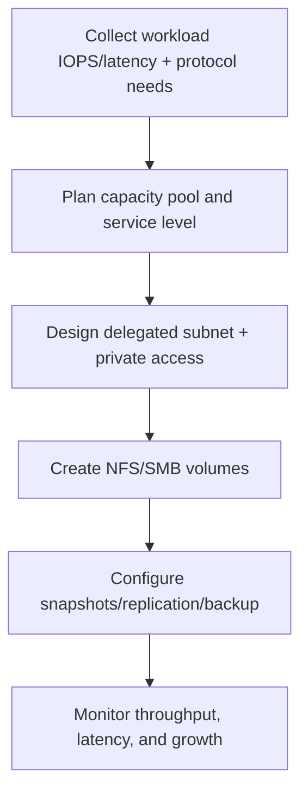
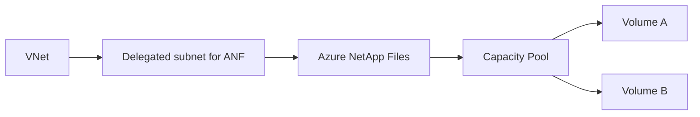
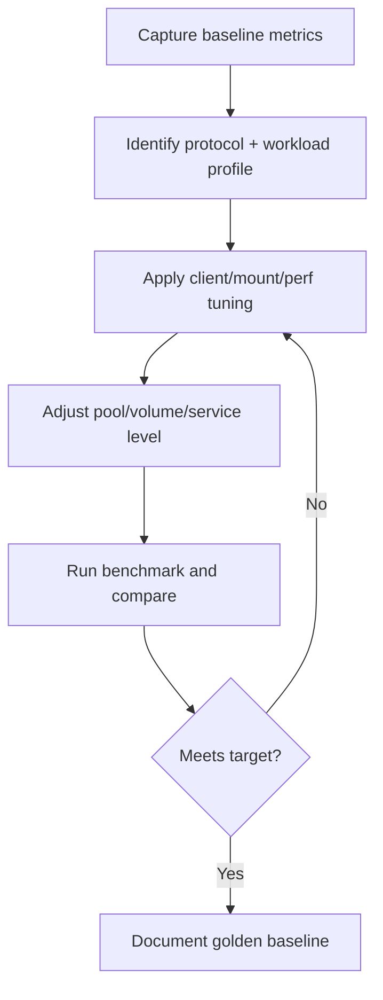
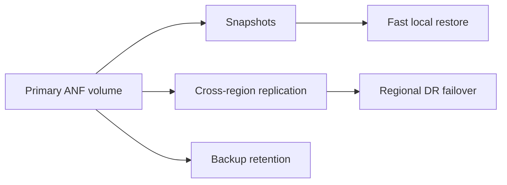
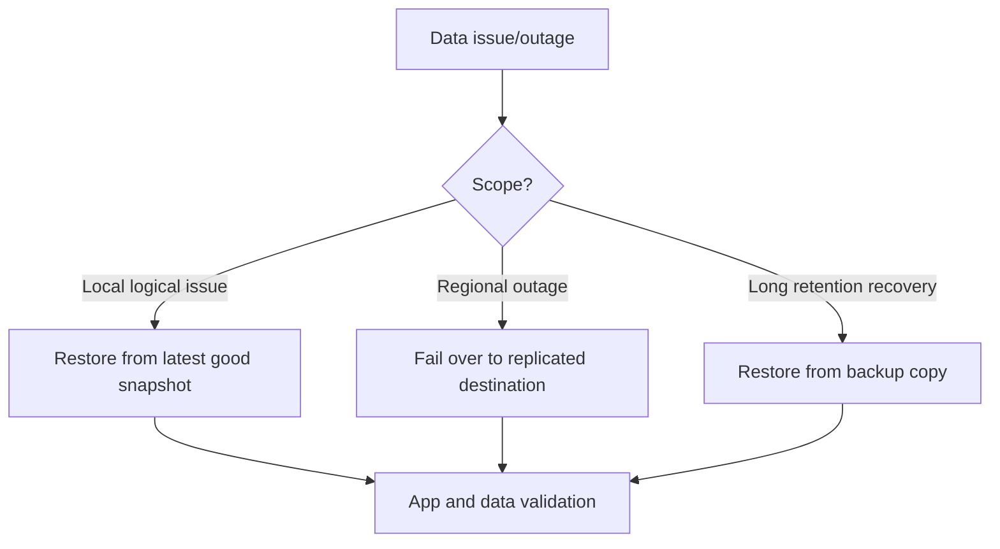
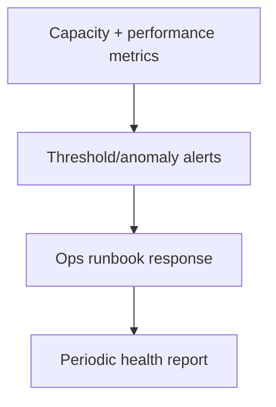
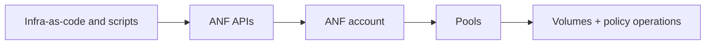

# Azure NetApp Files Deep Dive

## What is it?
Azure NetApp Files (ANF) is a high-performance, enterprise-grade, fully managed file storage service in Azure for NFS and SMB workloads.

It is designed for workloads requiring:
- Low latency and high throughput
- Shared file semantics
- Enterprise data management patterns

## What is it used for?
- SAP and enterprise application file workloads
- HPC/AI data pipelines needing high throughput
- Lift-and-shift file workloads from on-prem NAS
- Shared storage for Linux/Windows applications

## Why is it important?
General storage options are not always enough for performance-sensitive file workloads. ANF provides predictable enterprise-grade file performance and management.

## Workflow


---

## 1) Core ANF architecture concepts

Key components:
- **NetApp account**
- **Capacity pool** (performance/service level)
- **Volume** (NFS/SMB mounted by clients)
- **Delegated subnet** for ANF



---

## 2) Performance and service levels

ANF performance is tied to allocated capacity and selected service level.

Typical planning dimensions:
- Required throughput
- Latency sensitivity
- Data growth and burst behavior

### Practical guidance
- Start with measured baseline from current workload.
- Keep headroom for peak windows.
- Revisit capacity and service level as usage changes.

### Performance tuning workflow


### Common performance focus areas (public guidance themes)
- NFS concurrency and mount behavior
- SMB tuning for enterprise Windows workloads
- VM sizing and throughput headroom planning

---

## 3) Protocol and access patterns

Supported patterns include:
- NFS-based Linux workloads
- SMB-based Windows workloads
- Mixed enterprise environments (with correct identity/DNS planning)

### Security considerations
- Restrict network access with subnet and policy controls.
- Use least-privilege identity integration for SMB scenarios.
- Keep traffic private in VNet-based architectures.

### Protocol selection quick guide

| Mode | Best fit |
|---|---|
| NFS | Linux, HPC, analytics |
| SMB | Windows enterprise shares |
| Dual-protocol | Mixed Linux/Windows access |

---

## 4) Data protection for ANF

Key mechanisms:
- **Snapshots** for quick point-in-time recovery
- **Cross-region replication (CRR)** for DR posture
- **Backup** for policy/manual longer retention
- Application-consistent strategies where needed



---

## 5) Backup/restore pattern choices

| Pattern | Best for |
|---|---|
| Snapshot-only | Fast local recovery for operational mistakes |
| Snapshot + replication | Regional resilience and DR |
| Snapshot + backup | Compliance and long retention |

### Recovery workflow


### Important design note
If CRR is part of your architecture, validate current public support boundaries and backup considerations before finalizing DR policy.

---

## 6) Monitoring and alerting

Track at minimum:
- Capacity growth and remaining headroom
- Latency and throughput trend changes
- Snapshot/replication health
- Backup policy success/failure



---

## 7) Automation options

ANF operations can be automated using:
- Azure CLI (`az netappfiles`)
- REST API
- Terraform / Ansible
- PowerShell



---

## 8) Troubleshooting map

| Symptom | First check |
|---|---|
| Volume allocation failure | pool capacity, delegated subnet, quota |
| Replication unhealthy | CRR relationship and region pairing constraints |
| SMB issues | identity/DNS/permission path |
| NFS issues | client options, auth settings, concurrency |
| Snapshot policy issue | schedule and policy binding state |

---

## 9) Azure Portal checks

1. **Azure NetApp Files account**
   - capacity pools and service levels
2. **Volumes**
   - protocol, quota, mount path
3. **Networking**
   - delegated subnet and connectivity health
4. **Snapshots/replication/backup**
   - policy status and health checkpoints

---

## 10) Azure CLI checks (placeholders only)

```bash
# List ANF accounts
az netappfiles account list -g <rg> -o table

# List capacity pools
az netappfiles pool list -g <rg> --account-name <anf-account> -o table

# List volumes
az netappfiles volume list -g <rg> --account-name <anf-account> --pool-name <pool-name> -o table

# List snapshots for a volume
az netappfiles snapshot list -g <rg> --account-name <anf-account> --pool-name <pool-name> --volume-name <volume-name> -o table
```

---

## 11) Common mistakes

- Choosing service level without measured baseline
- Ignoring delegated subnet capacity planning
- No snapshot/restore testing
- Assuming replication exists without failover drills
- Poor protocol-specific identity and DNS planning

---

## 12) Public source alignment

This document aligns to public ANF themes commonly curated in community/public resources:
- General architecture and setup guides
- Performance references and tuning best practices
- Data protection (snapshots, CRR, backup)
- Monitoring/alerting and automation toolchains
- Troubleshooting guides and calculators

---

## Summary

| Area | Key takeaway |
|---|---|
| ANF role | Enterprise-grade high-performance file storage |
| Performance | Plan by measured throughput/latency and headroom |
| Protection | Use snapshots + CRR + backup by RPO/RTO |
| Operations | Monitor growth, health, and recovery readiness |
